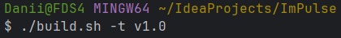
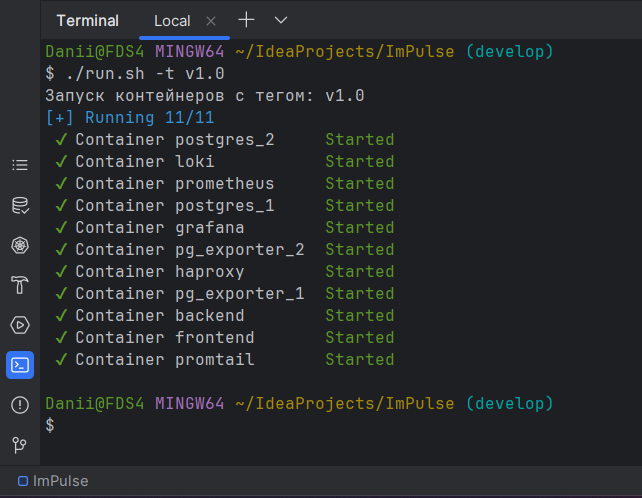
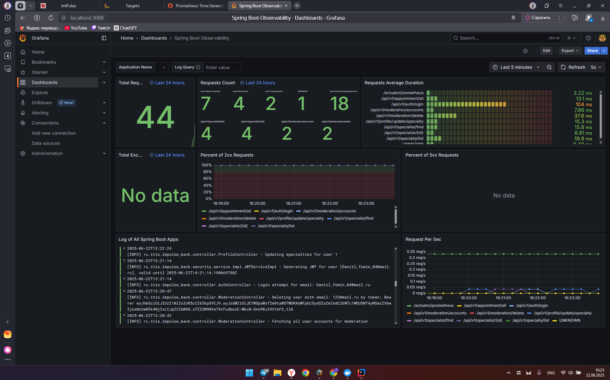
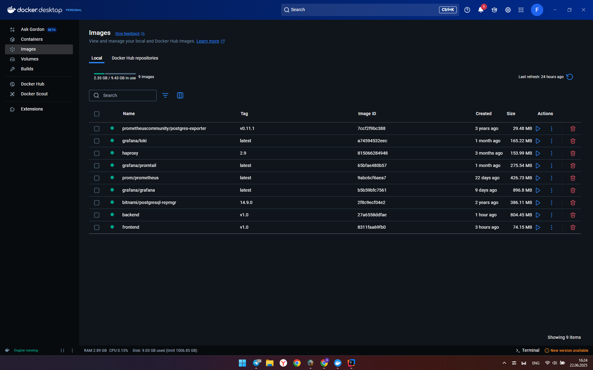
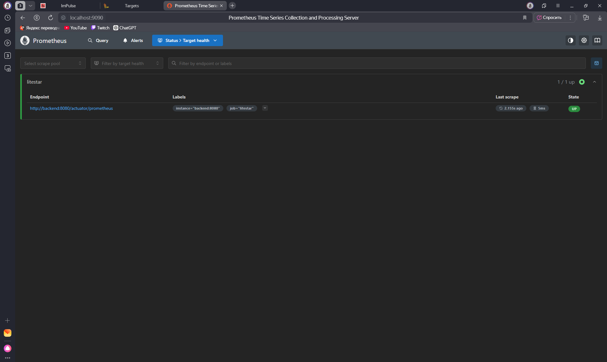
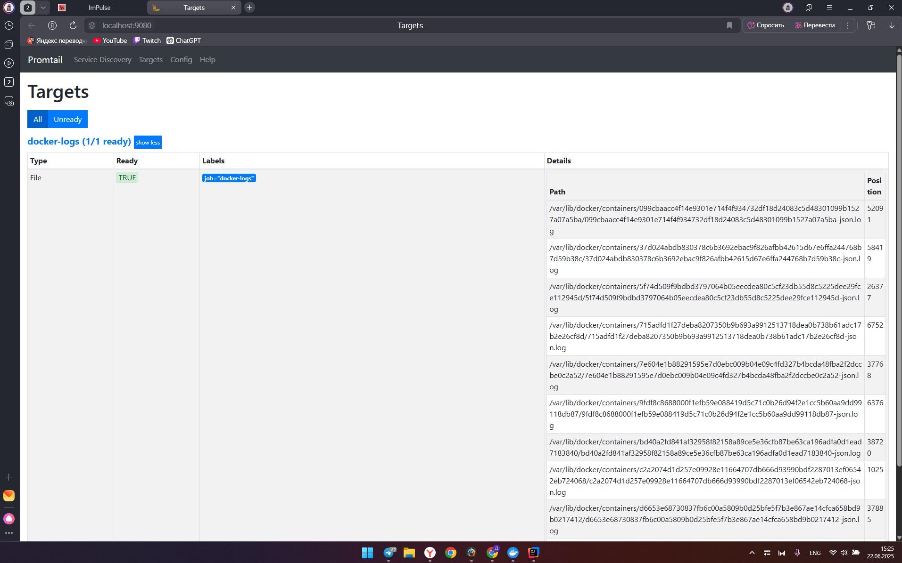

# ImPulse – демо веб-приложение

## Описание
Это учебное веб-приложение, состоящее из frontend (на Vue.js) и backend (Spring Boot).
Подключена кластерная БД PostgreSQL с репликацией через haproxy.
В систему входит стек мониторинга и логирования: Promtail, Prometheus, Loki, Grafana.

- [Документация ImPulse](https://docs.google.com/document/d/1d7-dOYGisRbLevdGnCuJMgfgFIVJyBu2Li3JAz_cuSo/edit?usp=sharing)

## Запуск
Осуществлялся запуск на JDK21, в Git Bash терминале Windows 11.

### ВАЖНО!
image: docker.io/bitnami/postgresql-repmgr:14.9.0 стал платным, и сборка проекта с репликацией баз данных (master-slave) теперь недоступна бесплатно. Мы работаем над версией проекта без репликации в отдельной ветке develop-hotfix-no-replication.

### Сборка (в ветке develop)
./build.sh -t v1.0

### Запуск (в ветке develop)
./run.sh -t v1.0

## Результаты:

