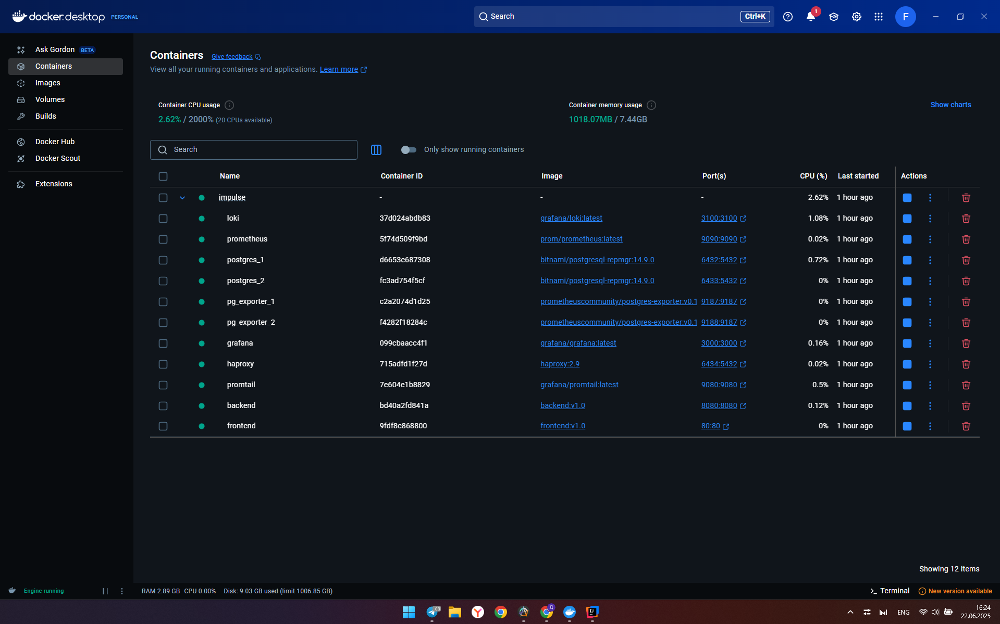

# ImPulse – демо веб-приложение

## Описание
Это учебное веб-приложение, состоящее из frontend (на Vue.js) и backend (Spring Boot).
Подключена кластерная БД PostgreSQL с репликацией через haproxy.
В систему входит стек мониторинга и логирования: Promtail, Prometheus, Loki, Grafana.

- [Документация ImPulse](https://docs.google.com/document/d/1d7-dOYGisRbLevdGnCuJMgfgFIVJyBu2Li3JAz_cuSo/edit?usp=sharing)

## Запуск
Осуществлялся запуск на JDK21, в Git Bash терминале Windows 11.

### Сборка (в ветке develop)
./build.sh -t v1

### Запуск (в ветке develop)
./run.sh -t v1

##Результаты:

